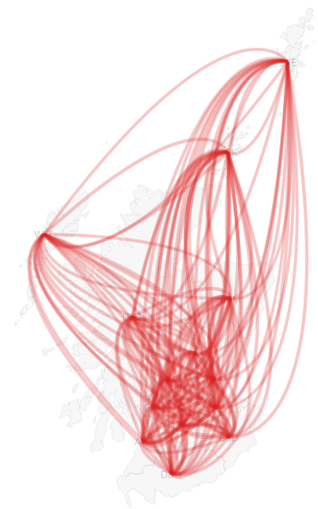
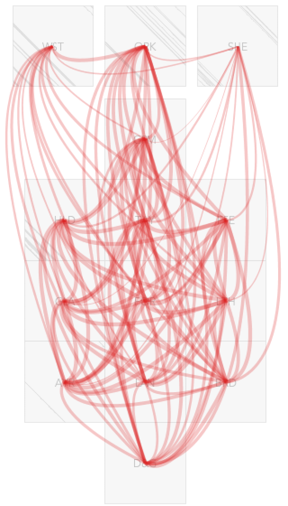
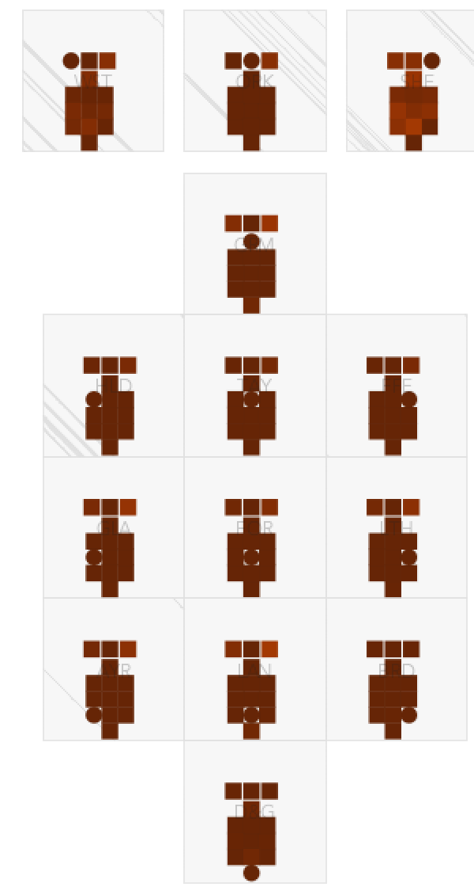

# Visualization of NHS Board Correlations

---

I'm going to keep pushing on the _chord diagram_ used in the dashboards - I don't think this is an effective encoding of relationships between places.

Make your own graphic from the [tables of correlations between NHS Boards](http://vis.scrc.uk/stat/v1/scotland/nhs-board/?table=cumulative_cases&metrics=pearson_correlation).

See what you can come up with.

Here are some views - I'd love to discuss these.

---

#### Let's Think Geographically

Surely as we are dealing with spatial processes, we need spatial encodings to understand how these processes operate over space at different scales and distances. They may even be directional or affected by geographic features - such as boundaries (mountains, valleys, sea, etc.).

Any informed analysis would account for this context, and graphics that support this analysis should do so too.

So, here are the relationships in their spatial contexts - line width is proportional to strength of association.

Wow, that's a mess.

---

#### Remove Redundancy

In fairness I am showing bi-directional flows here, so there is twice the information we need.

Let's cut that out.
Here we see unidirectional flows.

But it's still very difficult to see any differences in flow widths because of the occlusion, overlaps and because there is so little difference in the correlations.

---

#### Rescale to Reveal

We can re-scale a little, in this instance contravening one of Tufte's principles of graphical integrity:

> The representation of numbers as physically measured on the surface of the graphic itself, should be directly proportional to the numerical quantities represented.

Here we are re-scaling line widths from 08.-1.0 rather than from the full 0-1 range.

But at least we can see a little variation - we might begin to see where the undetectable variation is, even if we can't estimate or compare the quantities.

---

#### Make Space to Reduce Occlusion

I'd transform this to a semi-spatial grid. This lays the NHS boards out to retain some aspects of distance, topology and direction. NHR boards that are further north tend to be at the top, those that are further east tend to be over on the right. Those that are neighbours tend to be next to each other.

Importantly it uses gaps to represent and remind us about real geographical barriers, such as large stretches of water. We can learn this shape and relate it to the geography of Scotland.

Let's add those unidirectional flows.

We still have a mess, much like the _chord diagram_, with slightly thinner lines from Shetland? Maybe?

---

#### Re-Encode to Reveal Structure

So let's use an alternative representation of flows -
a matrix. Let's use colour encoding to show the correlation and position to show the geography.

Here, each map is positioned at the transformed location of a NHS Board. And each mini-map is a map of the correlation between this board and all others.

The circle shows the board that is the focus of the map  - and it's always dark brown as all boards have a correlation of 1 with themselves.

This layout enables us to see how correlations vary spatially.

Now we can see something interesting. The light colours in Shetland (top right) mean that the correlations are consistently low. The map in the Western Isles (top left) shows strong correlation with Orkney, which may have similar geographic characteristics, but weaker correlations with Shetland and the Mainland.

There are subtle spatial patterns too - Glasgow (mid left) is more like regions that are closer to is than those that are distant. Spatial autocorrelation at play.

We can also see that Borders (bottom right), and particularly Dumfries & Galloway (bottom) are correlated with one another, but less correlated with other NHS Boards. They have different profiles to the rest of Scotland. Correlations with one another are 0.99, with other parts of Scotland range from 0.92-0.98.

---

#### Take a Tufte (Design) Reality Check

But remember, we are looking at very small differences in these correlation coefficients.

Let's comply with Tufte's principle of graphical integrity, while remembering that we are poor at estimating quantities from colour, and show the entire range using an empirically validated [ColorBrewer _YlOrBrn_ scheme](https://colorbrewer2.org/#type=sequential&scheme=YlOrBr&n=9) ranging from 0-1.

This really emphasizes the _very small differences_ in the correlation coefficients.

We can no longer detect the differences between Borders and Dumfries & Galloway at all - reminding us that even with a 5% difference in numeric value, colours that are mapped according to Tufte's principles may not discriminate.

---

#### Message - The Importance of Considered Visualization Design and Visualization Exposition

One of the reasons for writing this is that we need to be thoughtful about design and clear about design decisions and intention. We need to be transparent about what the plots that we produce enable us to see and what they hide. Those who use the plots need to be informed and cautions in interpreting them.

My view is that design principles (such as Tufte's and others) help us with this. They help with decisions and make them explicit.

**Design exposition** such as the above (quickly cobbled together on a busy morning) is an important part of all of this in my view.

<!--
#### Visual Output

We can outputs for all _groups_ and all _states_ in their spatial contexts with a _Grid Map_. This layout attempts to maintain some of the original geography while giving each area equal space for graphics. This enables us to consider spatial relationships and variations between outputs and processes.

|Geographic Map|Grid Map|Model Output|
|--|--|--|
|||
 -->

Lot's of what Tufte says is unhelpful and has been discredited. But there is still some sense in his original book.

Remember ...

Graphics are most powerful when used as ...

> instruments for reasoning about quantitative  information"
_(Tufte, 2001, p53)_

And the designer’s task is ...
> the revelation of the complex
_(Tufte, 2001, p191)_

This takes some skill, experimentation and explanation.

---

**Jason DYKES**
_31st July 2020_

<!---
## INSIGHT

Closing offices has a big effect on cities, but mostly on short-distance commutes.
  --->
