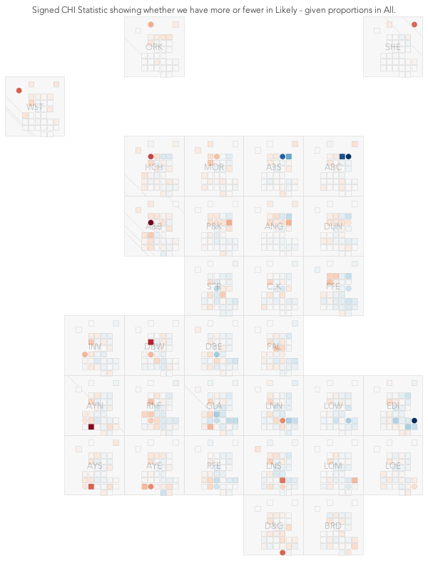

# Simple Network Sim - Visualization

---

Here I take _two questions_ that have come from discussions with the Simple Network Sim folks and use them to show how we apply _visualization_ to begin to answer them, and perhaps other related questions.

As part of this process, I have put together a (flakey, buggy, incomplete) DATA SKETCH.

It's a rapid combination of data, knowledge and functionality.
It shows a series of possibilities for interacting with _inputs_ and _outputs_ used in _simple_network_sim_.

It's intended to share and express knowledge, and prompt ideas, initially in relation to two key question that visualization might help with.
We hope that it will develop dialogue about data and design.

It's is INCOMPLETE, INCONSISTENT and UNRELIABLE.
It should only be used in close cooperation with _Prof. JASON DYKES_.

**PLEASE CHECK ANY FINDINGS WITH AN ADDITIONAL SOURCE.**

---

## QUESTION 1 - OUTPUT

> Origin **FG** :
> model outputs have priority maybe,
> e.g. being able to show the time series of people in each healthboard and disease state, through time. At least for myself this is the main thing I need visualization on.

> **_How do the numbers of people in each health state vary geographically over time?_**

At the moment I have access to [sample output files](https://github.com/ScottishCovidResponse/simple_network_sim/tree/master/sample_output_files) for _NHS Boards_ in Scotland.

|Sample Output|
|--|
|
|Click for [bigger pic](img/sample-1591198608.png)

The model produces data for _age groups_ (3 in the current data set) and _states_ through which the disease progresses as shown in the [Model Overview](https://github.com/ScottishCovidResponse/simple_network_sim/blob/master/model_overview_simple_network_sim.md)

|Disease Progression Model|
|--|
||
* **S**: susceptible|
* **E**: exposed, but not yet infectious |
* **A**: asymptomatic infectious individuals|
* **I**: symptomatic infectious individuals|
* **H**: hospitalised individuals|
* **R**: recovered (assumed immune)|
* **D**: dead |

#### Visual Output

We can outputs for all _groups_ and all _states_ in their spatial contexts with a _Grid Map_. This layout attempts to maintain some of the original geography while giving each area equal space for graphics. This enables us to consider spatial relationships and variations between outputs and processes.

|Geographic Map|Grid Map|Model Output|
|--|--|--|
|||

We can scale each graphic in different ways, _globally_ to see absolute numbers, _regionally_ as in the original to compare patterns across regions in relative terms, _by state_ so that we can compare patterns and peaks in each health state. This is important as the numbers vary by orders of magnitude across _regions_ and _states_. Sometimes we need to think about absolutes, at other times we need to think about relative numbers to inform decisions and make valid decisions.

|Global Scale|Region Scaling|State Scaling|
|--|--|--|
|||

We also have data for three different age groups, here they are shown separately with region scaling. Thicker lines are used for older groups.

|aged <18|aged 18-70|aged >70|
|--|--|--|
|||

It's tough to see things spatially when we are looking at all times concurrently, so we may need to check the outputs for one moment in time.

Here we have numbers for each age group for one health state - _Recovered_ - at three times in the sequence, as shown by the little dots in each graph. Scalings are global here.

|t = early|t = mid|t = late|
|--|--|--|
|||

Of course, with so many options for groups, states of health and scaling, we really need interactive software to help us work out what is going on.

#### Data Sketch

The _Data Sketch_ shows how this might work, and can be used to check models and establish some preliminary ideas about outputs and their spatio-temporal characteristics.

It runs in **_Processing 3_**, and will be available shortly on the giCentre GitHub repo.

You can see how this might all work in a short video that gives some ideas as to current functionality and how it might be used and developed.

<!-- <iframe src="https://player.vimeo.com/video/435490241" width="640" height="480" frameborder="0" allow="autoplay; fullscreen" allowfullscreen></iframe> -->

|Video on Vimeo|
|-|
|
|https://vimeo.com/435490241 password : **snsVIS**

#### (Back to) The Question?

> **_How do the numbers of people in each health state vary geographically over time?_**

Well, there are no clear spatial patterns in what are extremely regular temporal patterns in the sample outputs.

But hopefully the visualization gives us a sense of the complexity and variation that we can expect, and the kinds of functionality we might use to begin to explore and understand it.

As model outputs develop, it's likely that this kind of interactive spatio-temporal visualization will help us understand them.

---

## QUESTION 2 - INPUT

> Origin **JE** :
> how different are the networks used as inputs if we make different assumptions about which sectors of the workforce are travelling to work under different lockdown scenarios?

> **_Does it make a difference which types of workers we include in the INPUT NETWORK?_**
> **_How does this vary with space and scale?_**

###### NHS Boards

Each of these maps show daily flows between NHS Boards for those travelling to work. We used curved lines to show flow direction - the curved end is the destination of the flow. So we can see irregular ellipses where flows are stronger in one direction than the other.

The first two maps are different projections of the dame data. The third shows the flows in and out of Lothian (LTH) with the LTH->GLA flow being the biggest between board flow.
The fourth shows internal flows (those traveling to work within NHS Health Boards) with Edinburgh (LTH) and Glasgow having the most within NHS Board commuters. These internal flows use are scaled in the same way as the region-region flows, with width representing the number of people travelling to work within each local authority.

|Flow Map All Flows|Grid Map All Flows|Lothian Flows (LOT)|Grid Map with Internal Flows|
|--|--|--|--|
||||

###### Local Authorities

We have flow data by _employment sector_ for _Local Authorities_ and have done more work at this level.

Let's look at all daily trips to work ...
|All Daily Travel|All Daily Travel - Flows of > 128 people
|--|--
|||
|All trips to work, with line widths representing number of daily flows.|The smaller flows may be important, but let's filter them out for now.

|All Daily Travel|All Daily Travel - Grid Map
|--|--
|||
|We re-project on to the grid map, which retains the essence of the original geography, but gives us equal space for each LA. |This gives us the room to show the internal flows the width of each vertical line is proportional to the number of people travelling to work within each LA, using the same scale as we use for the flows between local authorities.

The key question that we're interested in is whether or not it makes a difference if we consider different flow networks as _input_ into the simulation model. We use the census, which provides data relating to daily travel to work. If we make different assumptions about who is moving, and thus how many people are moving between each area for which we have data, then the model will produce different outputs. The census gives us data about numbers of people who move between areas per employment sector. We have aggregated these into 4 groups for analysis :

* **Likely Operating** - workers in sectors that are Likely to be operating during Lockdown
* **Maybe** - workers in sectors that May be operating during Lockdown
* **Closed (office)** - workers in sectors that are Closed during Lockdown (office)
* **Closed (other)** - workers in sectors that are Closed during Lockdown (not office)

We also have the total figures for **All** workers.

Let's look at daily flows within (_vertical lines_) and between (_curved lines_)  Local Authorities. In each map the grey flows show the total - _All_ daily trips to work as recorded in the census.

|Likely Operating|Maybe|Closed (office)|Closed (other)
|--|--|--|--
||||

It's a complex picture, even when we cut it down to the larger daily flows, but we can see differences that strongly suggest that the way we model the input network with employment types may have effect.

Let's look at _differences_ in the number of people travelling to work each day.

One thing we can look at is the difference between categories. For example, are there big differences between the numbers in _Closed Office_ and _Likely Operating_.
This simple difference shows positive numbers in red and negatives in blue. The mass of blue shows us that the biggest differences are for internal flows (which is where most of the movement is, as we have seen) and that in most cases there are fewer people in the _Closed Office_ sectors that in _Likely Operating_. But the _red_ flows are very spatially focussed - on _Edinburgh City_, where many of flows in to the city contain more people in the _Likely Operating_ sectors than in _Closed Office_. These are not large numbers, comprising of differences of hundreds rather than thousands of people, around 5-10% of all flows, but the phenomenon is peculiar to Edinburgh.

The differences between the roles moving in and out of Aberdeen are also noticeable.

|Closed Office - Likely Operating|Closed Office - Likely Operating Edinburgh City only|Geographic Projection
|--|--|--
|||

The absolute numbers may be interesting, but looking at the differences between the proportions we might expect in the _Likely Operating_ category given the sizes of flows in _All_ provides useful insights. We can use a _signed CHI statistic_ for this. We look at the overall numbers in _All_ and _Likely Operating_ and use the _All_  proportions to calculate _expectations_ for _Likely Operating_. The assumption here is that we might expect to have fewer people travelling under lockdown, but the numbers might reduce by the same proportions across the board. We compare the numbers expected under this proportional assumption to the _observed_ numbers in _Likely Operating_ and scale by the _expectation_ - thereby favouring proportionate deviations from large flows over small ones. This lets us see where, and how, the use of _Likely Operating_ as an input differs from using _All_. If there is spatial structure to the differences, then this is likely to be important in the simulation modelling.

|Signed CHI statistic Larger Differences|Larger Differences Glasgow highlighted|Signed CHI statistic All flows
|--|--|--
|||

Here we see patterns that show _Likely Operating_ flows to be very different from _All_, with clear spatial structure. _Aberdeen_, _Edinburgh_ and _Glasgow_ are the focus of _Likely Operating_ flows that are _smaller_ than we might expect given the numbers in _All_. Flows *out* of _Edinburgh_, *between* _Aberdeen_, and *north* and *east* *from* _Glasgow_ are smaller than we expect under the proportions that we see in _All_. Flows *west* *from* _Glasgow_ and particularly *into* _Argyll & Bute_ are consistently greater in _Likely Operating_ than we might expect given _All_. These are not _big_ numbers, but they do show clear spatial differences between the _Likely Operating_ and _All_ flows.

Geographic trends in differences between _All_ daily trips and _Likely Operating_ are particularly clear in the second Grid Map with Glasgow selected. _Blue_ to the north and east means fewer trips under _Likely Operating_ than under the _All_ input network, _red_ to the west means more.

Looking at all flows suggests that these patterns persist when smaller differences between _All_ daily flows and _Likely Operating_ are considered.
<!---
|t|t|t
|--|--|--
|||
|txt|txt|txt|
--->

The grid maps are a little unfamiliar, so let's consider **two more views**.

The patterns persist if we check the geographic projection, with the _lower than expected_ numbers for flows _north-west_ out of the central valley and the _larger than expected_ flows _east_ dominating.

Each OD map shows a map of destinations from the location at which the map is positioned. If there were no spatial effects then we would expect red and blue cells to be randomly distributed. But the clear patterns show spatial structure in the differences between _Likely Operating_ and _All_, meaning that it is likely that there will be spatial effects in the model outputs depending upon which of these flow networks is used to model spatial interaction.

|Geographic Projection Central Valley Highlighted|OD Map No Highlights|
|--------------------|--------------------|--------------------|
||
|_Blue_ lines show fewer trips west from the highlighted Central Valley under the _Likely Operating_ input network, and also Aberdeen City in the north-west|OD map shows maps of destinations for all (circular) origins. Clusters of read and blue show clear spatial structure in differences between _All_ and _Likely Operating_.|

#### Data Sketch

Of course, we need to consider all of these graphics, and others, quickly as we assess the data, with controls and interactions to specify what we see and how we see it. The _Data Sketch_ shows how this might work.

This second short video gives some ideas as to current functionality for assessing inputs and shows how it might be used and developed.

<!-- <iframe src="https://player.vimeo.com/video/435490241" width="640" height="480" frameborder="0" allow="autoplay; fullscreen" allowfullscreen></iframe> -->

|Video on Vimeo|
|-|
|
|https://vimeo.com/435735366 password : **snsVIS**

#### (Back to) The Question?

> **_Does it make a difference which types of workers we include in the INPUT NETWORK?_**
> **_How does this vary with space and scale?_**

Briefly, **YES**, even at this large scale (Local Authority).
Preliminary work at MSOA level suggests pronounced differences in daily travel between employment sectors and so the input network will be sensitive to this (_see below_).

We should experiment with inputs to see effects on model outputs.
Interactive visualization may help!

---

#### Preliminary Work - (on with) The Question?

###### MSOAs - Glasgow and Strathcylde

Data are likely to be available at _Data Zone_ level, and we may be modelling at much finer resolution. We have looked at _MSOAs_ in _Glasgow and Strathcylde_ to get a sense of the variation at this scale. _MSOAs_ are a little bigger than _Data Zones_.

|Geographic Projection|Grid Map|
|--------------------|--------------------|--------------------|
||
|Largest flows between MSOAs|Largest flows between MSOAs

We can calculate differences between the numbers of trips observed in _Likely Operating_ and those _expected_ under the assumption that proportions are in line with _All_ flows.

These simple difference maps show origins of those who travel to each destination (so these are _DO Maps_!). There is definite spatial structure at this scale. Flows in to the City Centre and some other areas south east of the Clyde are consistently _blue_ , meaning that we have _fewer_ people and _smaller flows_ into these destinations than we would expect.
But there are also destinations that have many _red_ lines converging on them. These are the areas in which we have relatively more trips under _Likely Operating_ than we would expect under the proportions predicted by the flows that we see in _All_ .

Absolute differences are in the 20s, 40s, 60s for each pair of MSOAs, but the _blue_ and _red_ spatial structure shows that there are geographic differences in the flows associated with different employment sectors.

|Flow Map - Largest FLows|
|-|
|
|Largest flows between MSOAs shown as a flow map in which particular destinations have very clear signatures of flows that are greater (_red_) or less (_blue_) than predicted by _All_ flows.|

|DO Map - All Flows|
|-|
|
|All flows between MSOAs are shown in maps of the origins of flows arriving at each each destination. The focussed coloured maps show that the big differences are in certain destinations, and the consistently _red_ (greater numbers) or _blue_ (lower numbers) nature of these maps means that flows from all sources are consistently under-or over predicted.

**Preliminary analysis suggests that the effects are more significant at higher resolution.**
**Analysis summary to come ...**

---

**Jason DYKES**
_5th July 2020_
_6th July 2020_

<!---
## INSIGHT

Closing offices has a big effect on cities, but mostly on short-distance commutes.
  --->
