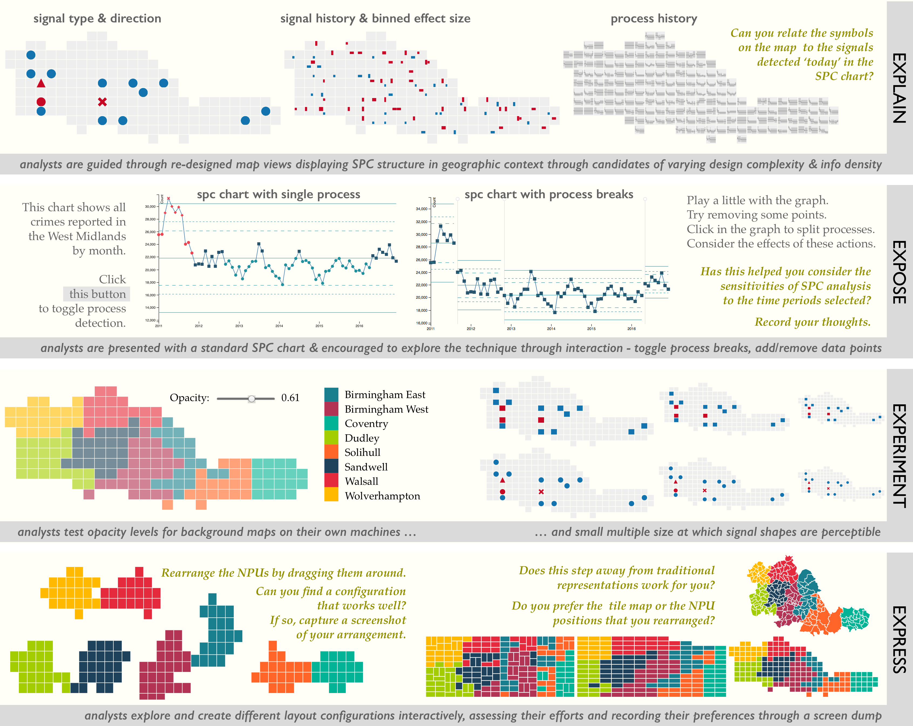

## RAMPVIS - 'Coherent Reporting' Meeting Plan - 210223

> Cagatay, Aidan, Rita, Tom, Jason?

_Recommendations, from **Rogers et al. (2020)** - that we are ..._

#### ABUNDANT
  - where to put things?
  - how to flag / label / annotate them?

#### REFLEXIVE

_explicit and thoughtful self-awareness_

  - structured notes before and after
  - _reflect in action_ - reflective memos
  - _reflect on action_ - revisiting experiences

#### TRANSPARENT
  - evidence and analysis

---

### Reflective Design Study Research (Paper) Proposal

_Jason's Doc of 210205 ..._

#### Suggestions Recommendations

 - systematic reflective practices

#### Things to Decide

1. how do we record? **tech plus process**
1. individuals and anonymity, permission

 * MEMOS - should contain, and be inspired by
   - **DIRECTION** - what changed, what shifted? _record pivots_
   - **REACTION** - what surprised?
   - **TRACTION** - what resonated?

---

## How to Record?

_Possibilities include ..._

1. ##### Chronological Inline Narrative

 - e.g. Aidan's notes - https://github.com/aidans/ramp/tree/main/notes

2. ##### DESIGN DISCOURSE
  - Explicit questions - https://gicentre.github.io/scrc/docs/flow/allScotland.html

3. ##### DExD Structure
  * _EXPLAIN_ - guide collaborators through redesigns
  * _EXPOSE_ - show limitations in current approach
  * _EXPERIMENT_ - (EXPLORE) get analysts to play with alternatives and check preferences
  * _EXPRESS_ - explicitly set or select preferences 
  

4. ##### litvis

 * structured markdown documents with validation
 * see [litvisExample.md](litvisExample.md) and associated yaml - [design.yml](../narrative-schemas/design.yml)

---

**JD 210223**
