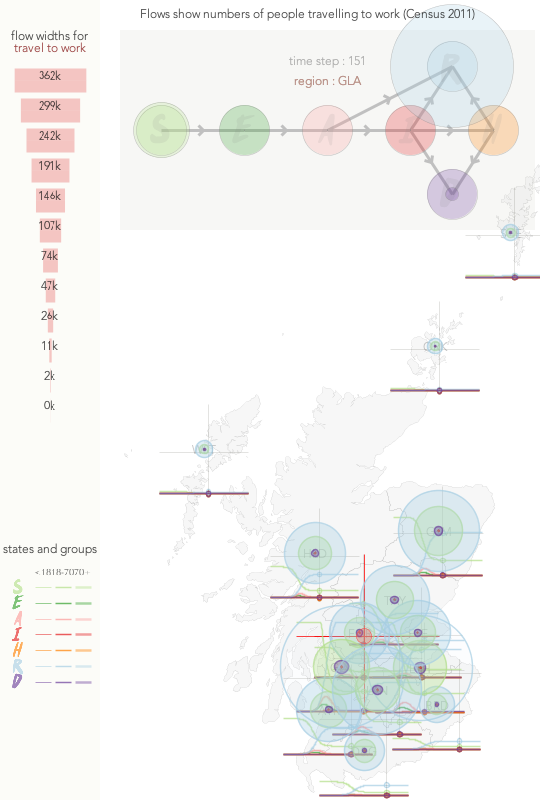
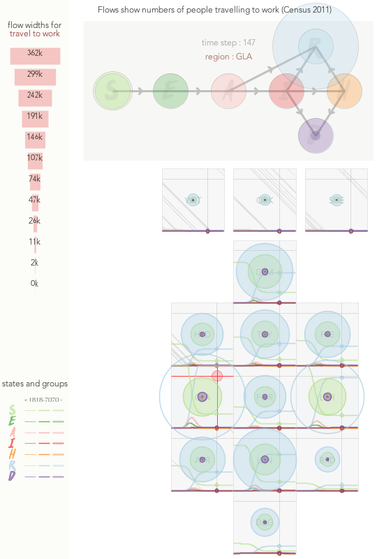
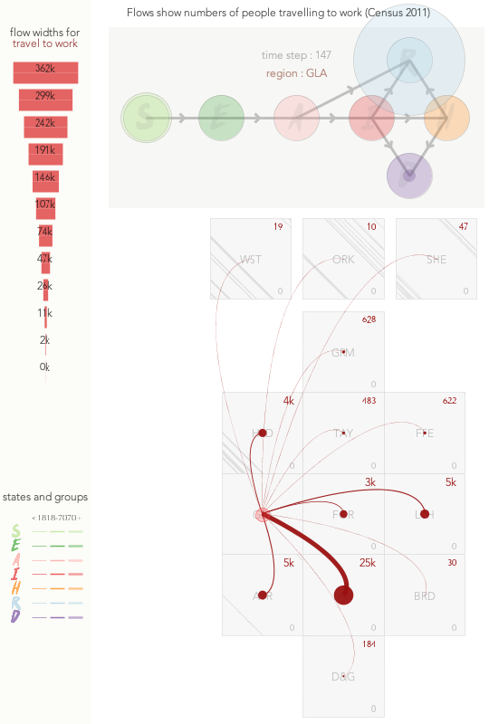

## 1. The Visualization Approach

We aim to show patterns & relationships in detail through **data rich graphics** that are **designed** to be **interpretable** and **informative**.

We draw on centuries of knowledge developed in **cartography**, **design**, **cognitive psychology** and **computer science** to develop approaches that suit particular :

&nbsp;&nbsp;&nbsp;&nbsp;&nbsp;&nbsp;**questions**, **people**, **data types**, **data sets**, **settings**

1. Show many things concurrently - _no grouping_
1. Reveal the unseen - _effective, creative visual design_
2. Provide control over what is seen when as needs, data sets and knowledge change and develop - _effective, creative interaction design_

We draw upon principles & algorithms developed in our discipline to make the complex interpretable (we have good solutions that we can **adopt** and **adapt**)

---

## 2. How It Works

#### Medium Term VIS

_**Normally**, software engineering with engaged co-design ..._

 * requirements, discussion, exploration -> iteratively developed system
 * we build for you, you operate

#### Rapid VIS

_**Now**, we have volunteer capacity but little time in the COVID emergency, so ..._

 1. **you** express a problem / question
    > log this on 'VIS Help' channel
    > we allocate whoever has skills, knowledge & capacity
 4. **we** provide visual answers in 24 hours (or so)
 5. **then** iterate, close or start again

###### We are your rapid VIS analysis & design task force!

---

## 3. A Visualization Example :

#### simple_network_sim output

> **Q** - **How do the numbers of people in each health state vary geographically over time?**

> **D** - 58,800 numbers
 * 200 time steps
 * 14 NHS Boards (regions)
 * 7 health states
 * 3 age groups

 > **K** - important to know that ...

 * geographic units vary in size
 * numbers in outputs (by state) vary by orders of magnitude
 * states are related in a network
 * no explicit (quantified) uncertainty

> **V** - visualization to see or compare any useful subset(s) of these numbers :

_Use algorithms, design patterns and knowledge of perception & cognition to develop plausible & effective graphics that ..._

  * compare places
  * compare times
  * compare age groups
  * compare states
  * compare states for age group
  * compare states for age group over time
  * _etc._

|Design Ideas|||
|-|-|-|
|||

> **I** - interact to get what you need

_Rapid, intuitive, consistent real time interactions to navigate through all (possible, useful) views of the data to ..._

  * get specifics
  * change encoding - layout, emphasis, scaling
  * change selection - filter
  * change speed
  * annotate / record

|Interactive Design Prototype|
|-|
||

> **A** - So what do we know?

#####There are no clear spatial patterns in what are extremely regular temporal patterns in the sample outputs.

#####The visualization gives us a sense of the complexity and variation that we can expect, and the kinds of functionality we might use to begin to explore and understand it.

#####As model outputs develop, it's likely that this kind of interactive spatio-temporal visualization will help us understand them.

#### More Details

More details and more graphics relating to this example are available .
 * https://gicentre.github.io/scrc/docs/simpleNetworkSim-VIS/questions.html

---
**Jason DYKES**
20/07/06
